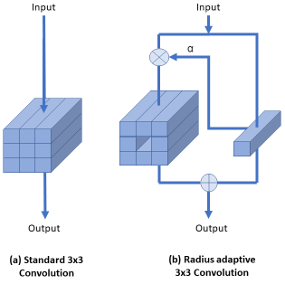

# RACNN
### Radius Adaptive Convolutional Neural Net

Radius adaptive CNN is a method that adopts different kernel
sizes (or radii) based on the input content. α defines how much of
the neighboring pixels are taken into account. α=0 and α=1 are
equivalent to 1x1 and 3x3 convolutions.

**The repository includes:**
* Source code of RACNN for CPU and GPU for VGG16 and Resnet50
* Graphs for VGG16, Resnet50, VGG16-RACNN, and Resnet50-RACNN
* Test images
* Trained weights for COCO dataset
* Demo examples

## Getting Started with Python
* [racnn_cpu_demo](racnn_cpu_demo.ipynb) is a simple demonstration of 
RACNN using CPU.
* [racnn_gpu_demo](racnn_gpu_demo.ipynb) is a simple demonstration of 
RACNN using NVIDIA GPU.
* [keras_demo](../keras/keras_demo.ipynb) contains graphs and Keras implementations.
* [results](../results/results.ipynb) contains the most recent results.

## Installation (Python)

1. Install dependencies

   `pip3 install package` [numpy, keras, opencv-python  ...]

2. Clone this repository

3. Run setup from the `racnn/libs` directory
    * for CPU
    `python3 setup.py install`

    * for GPU
    `python3 setup_gpu.py install`

	**or**:

	`python3 setup.py build` and copy the compiled modules (*.pyd for windows and *.so for linux to your working directory) 	
     

### Results

Results will be updated [here](results/results.md)

### Weights and test data

weights and test data can be downloaded from [racnn1.0](https://github.com/meisamrf/racnn/releases/tag/1.0)
